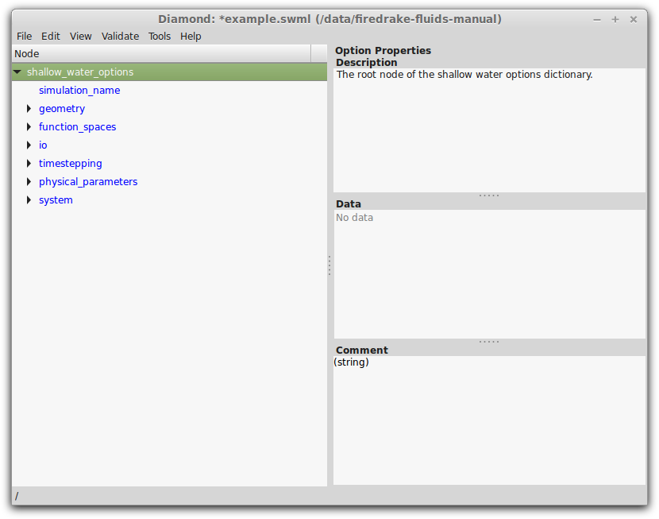
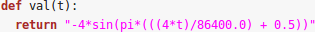

Diagnostic fields
=================

Some stand-alone functions are available in the ``diagnostics.py`` file
for computing flow diagnostics.

Courant number
--------------

The Courant number diagnostic computes the field defined by

.. math:: \frac{||\mathbf{u}||\Delta t}{\Delta x},

where :math:`\Delta t` is the time-step size and :math:`\Delta x` is the
element size (more specifically, it is twice the element’s
circumradius).

Grid Reynolds number
--------------------

The Reynolds number (whose length scale is relative to the element size
:math:`\Delta x`\ ) is defined by

.. math:: \mathrm{Re} = \frac{\rho||\mathbf{u}||\Delta x}{\mu},

where :math:`\rho` is the fluid density, :math:`\mu` is the dynamic
viscosity, and :math:`||\mathbf{u}||` is the magnitude to the velocity
field. Alternatively,

.. math:: \mathrm{Re} = \frac{||\mathbf{u}||\Delta x}{\nu},

where :math:`\nu` is the kinematic viscosity.

Divergence
----------

This diagnostic field computes the divergence

.. math:: \nabla\cdot\mathbf{u},

of a vector field :math:`\mathbf{u}`\ .

.. |image2| image:: images/shallow_water_h_H.png

