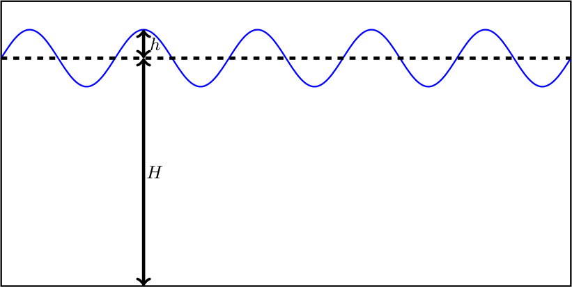
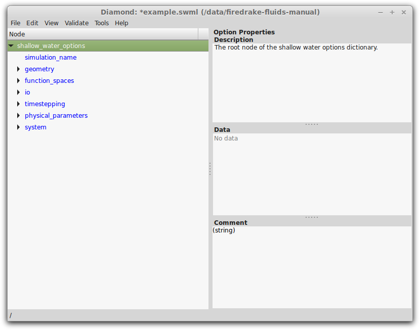
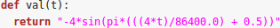

Shallow water model
===================

The shallow water model solves the non-linear, non-rotational shallow
water equations which describe the dynamics of a free surface and a
depth-averaged velocity field. For modelling purposes, the free surface
is split up into a mean component :math:`H` (i.e. the hydrostatic depth
to the seabed) and a perturbation component :math:`h` (see Figure
shallow_water_setup_).

.. _shallow_water_setup:

   Single-layer shallow water set-up.

Model equations
---------------

The shallow water equation set comprises a momentum equation and a continuity equation, each of which
are defined below. These are defined on a domain :math:`\Omega` and for
a time :math:`t \in [0, T]`\.

Momentum equation
~~~~~~~~~~~~~~~~~

The momentum equation is solved in non-conservative form such that

.. math:: \frac{\partial \mathbf{u}}{\partial t} + \mathbf{u}\cdot\nabla\mathbf{u} = -g\nabla h + \nabla\cdot\mathbb{T} - C_D\frac{||\mathbf{u}||\mathbf{u}}{(H + h)},

where :math:`g` is the acceleration due to gravity, :math:`\mathbf{u}`
is the velocity, and :math:`C_D` is the non-dimensional drag
coefficient. The stress tensor :math:`\mathbb{T}` is given by

.. math:: \mathbb{T} = \nu\left(\nabla\mathbf{u} + \nabla\mathbf{u}^{\mathrm{T}}\right) - \frac{2}{3}\nu\left(\nabla\cdot\mathbf{u}\right)\mathbb{I},

where :math:`\nu` is the isotropic kinematic viscosity, and
:math:`\mathbb{I}` is the identity tensor.

Continuity equation
~~~~~~~~~~~~~~~~~~~

The continuity equation is given by

.. math:: \frac{\partial h}{\partial t} + \nabla\cdot\left(\left(H + h\right)\mathbf{u}\right) = 0.

Discretisation and solving
~~~~~~~~~~~~~~~~~~~~~~~~~~

The model equations are discretised using a Galerkin finite element
method. Essentially, this begins by deriving the weak form of the
equations by multiplying through by a test function
:math:`\mathbf{w} \in H^1(\Omega)^3` (where :math:`H^1(\Omega)^3` is the
first Hilbertian Sobolev space ) and integrating over :math:`\Omega`\.
In the case of the momentum equation, this becomes

.. math:: \int_{\Omega}\mathbf{w}\cdot\frac{\partial \mathbf{u}}{\partial t}\ \mathrm{dV} + \int_{\Omega}\mathbf{w}\cdot(\mathbf{u}\cdot\nabla\mathbf{u}) \ \mathrm{dV} = -\int_{\Omega}g\mathbf{w}\cdot\nabla h \ \mathrm{dV} + \int_{\Omega}\nabla\mathbf{w}\cdot \mathbb{T} \ \mathrm{dV} - \int_{\Omega}C_D\mathbf{w}\cdot\frac{||\mathbf{u}||\mathbf{u}}{(H + h)} \ \mathrm{dV}.

A solution :math:`\mathbf{u} \in H^1(\Omega)^3` is sought such that it
is valid :math:`\forall \mathbf{w}`\.

The solution fields :math:`\mathbf{u}` and :math:`h` are each
represented by a set of interpolating basis functions, such that

.. math:: \mathbf{w} = \sum_{i=1}^{N_\mathrm{u\_nodes}} \phi_i\mathbf{w}_i,

.. math:: \mathbf{u} = \sum_{i=1}^{N_\mathrm{u\_nodes}} \phi_i\mathbf{u}_i,

and

.. math:: h = \sum_{i=1}^{N_\mathrm{h\_nodes}} \psi_ih_i,

where :math:`\phi_i` and :math:`\psi_i` are the basis functions
representing the velocity and free surface perturbation fields,
respectively; :math:`N_\mathrm{u\_nodes}` and
:math:`N_\mathrm{h\_nodes}` are the number of velocity and free surface
solution nodes, respectively; and the coefficients :math:`\mathbf{u}_i`
and :math:`h_i` are to be found by a solution method. If the basis
functions :math:`\phi_i` are continuous across each cell/element in the
mesh, then the method is known as a *continuous* Galerkin (CG) method,
whereas if the basis functions are discontinuous, then the method is
known as a *discontinuous* Galerkin (DG) method.

The momentum equation, discretised in space, then becomes a matrix
system:

.. math:: \mathbf{M}\frac{\partial\mathbf{u}}{\partial t} + \mathbf{A}(\mathbf{u})\mathbf{u} + \mathbf{K}\mathbf{u} = -\mathbf{C}h + \mathbf{D}(\mathbf{u}, h)\mathbf{u},

where :math:`\mathbf{M}`\ , :math:`\mathbf{A}`\ , :math:`\mathbf{K}`\ ,
:math:`\mathbf{C}` and :math:`\mathbf{D}` are the mass, advection,
stress, gradient and drag matrices, respectively.

The time-derivative is discretised using the implicit backward Euler
method, yielding a fully discrete system of equations:

.. math:: \mathbf{M}\frac{\mathbf{u}^{n+1} - \mathbf{u}^{n}}{\Delta t} + \mathbf{A}(\mathbf{u}^{n+1})\mathbf{u}^{n+1} + \mathbf{K}\mathbf{u}^{n+1} = -\mathbf{C}h^{n+1} + \mathbf{D}(\mathbf{u}^{n+1}, h^{n+1})\mathbf{u}^{n+1},

where :math:`\Delta t` is the time-step.

The finite element method is also applied to the continuity equation,
which must be solved along with the momentum equation, yielding a
block-coupled system. In Firedrake-Fluids, this system is preconditioned
using a fieldsplit preconditioner and solved with the GMRES linear
solver.

Configuring a simulation
------------------------

[sect:configuring\ :sub:`as`\ imulation] The configuration/setup of a
shallow water simulation in Firedrake-Fluids is defined in a Shallow
Water Markup Language (.swml) file. This is essentially an XML file that
contains tags/elements which are specific to the context of a shallow
water simulation. The full range of possible options that are available
to the user are defined by a set of schema files in the ``schemas``
directory; these can be thought of as ‘templates’ from which an .swml
setup file can be constructed.

Creating a shallow water setup/configuration file is best done using the
Diamond graphical user interface (GUI) that is supplied with the libspud
dependency. At the command line, from the Firedrake-Fluids base
directory, creating an .swml file called ``example.swml`` can be done
using

``diamond -s schemas/shallow_water.rng example.swml``

Note that the -s flag is used to specify the location of the schema file
``shallow_water.rng``, while the final command line argument is the name
of the setup file we want to create. The Diamond GUI will look something
like the one shown in Figure diamond_.

.. _diamond:

   The Diamond graphical user interface. Notice that all the
   available options are currently in blue; this means that they still need
   to be specified the user, after which the font colour will turn black.  

Details of each of the options (and sub-options underneath, displayed by
clicking the black arrows) are given in the following sub-sections.

Simulation name
~~~~~~~~~~~~~~~

All simulations must be given a name under ``/simulation_name``. This
name is used when outputting solution files created during the
simulation. Please use alpha-numeric characters and avoid using
non-standard characters such as ampersands, commas, semi-colons, etc
here.

Geometry
~~~~~~~~

The ``/geometry`` section of the setup file concerns the dimension of
the problem, and the location of the computational mesh used to
discretise the domain.

The dimension should be one of the first options to be set. Be careful
here; this option can only be set once because other options further
down the list rely on it.

In the case of the mesh file location, note that only Gmsh ``.msh``
files are supported.

Function spaces
~~~~~~~~~~~~~~~

Since two fields, velocity :math:`\mathbf{u}` and free surface
perturbation :math:`h`\ , have to be solved for in the shallow water
model, two function spaces may be specified. In Firedrake-Fluids, the
function spaces are assumed to be composed of Lagrange polynomial basis
functions. The order of these polynomials can be specified in the
``degree`` sub-option of each ``function_space``. The ``family`` refers
to whether the basis functions are continuous or discontinuous across
the cells/elements of the mesh.

Input/output (I/O)
~~~~~~~~~~~~~~~~~~

Solution files may be dumped at specific intervals, specified in time
units. Setting the ``io/dump_period`` option to zero will result in
dumps at every time-step. Note that solution files can currently only be
written in VTU format (see http://www.vtk.org for more information).

Users can also enable checkpointing which allows them to resume the
simulation at a later time. The checkpoint data will be written to a
file called ``checkpoint.npz``. The time interval between checkpoint
dumps can be specified under ``io/checkpoint/dump_period``. The
simulation can be later resumed by specifying the location of this file
with the ``-c`` flag (see Section [sect:running\ :sub:`as`\ imulation]
for more details).

Timestepping
~~~~~~~~~~~~

The time-step :math:`\Delta t` and finish time :math:`T` are specified
under ``timestepping/timestep`` and ``timestepping/finish_time``,
respectively. The ``timestepping/start_time`` (i.e. the initial value of
:math:`t`\ ) is usually set to zero.

For simulations which are known to converge to a steady-state,
Firedrake-Fluids can stop the simulation when the maximum difference of
all solution fields (i.e. :math:`\mathbf{u}` and :math:`h`\ ) between
time :math:`n` and :math:`n+1` becomes less than a user-defined
tolerance; this is specified in ``timestepping/steady_state/tolerance``.

Physical parameters
~~~~~~~~~~~~~~~~~~~

The only physical parameter applicable to the equation set solved in the
Firedrake-Fluids shallow water model is the acceleration due to gravity.
This is approximately 9.8 ms:math:`^{-2}` on Earth.

System: Core fields
~~~~~~~~~~~~~~~~~~~

The model requires three fields to be set up under the
``/system/core_fields`` section of the setup file. These are the key
fields used in shallow water simulations, and are named

-  *Velocity* (a prognostic field, corresponding to :math:`\mathbf{u}`\ ).

-  *FreeSurfacePerturbation* (a prognostic field, corresponding to
   :math:`h`\ )

-  *FreeSurfaceMean* (a prescribed field, corresponding to :math:`H`\ )

It is here that the initial and boundary conditions for the fields can
be specified. These can either be constant values, or values defined by
a C++ expression.

C++ expressions
^^^^^^^^^^^^^^^

Non-constant values for initial and boundary conditions can be specified
under the ``cpp`` sub-option; here, a Python function needs to be
written which returns a string containing a C++ expression. An example
is given in Figure cpp_expression_.

.. _cpp_expression:

   An example of a Python function returning a string
   containing a C++ expression. This C++ expression is used to define the
   non-constant values of a boundary condition. The function must be called
   ``val`` and have the argument ``t``, which is the current simulation
   time that may be included in the C++ expression. The variable ``x``
   contains the coordinates of the domain (i.e. ``x[0]``, ``x[1]`` and
   ``x[2]`` are the :math:`x`\ , :math:`y`\ , and :math:`z` coordinates,
   respectively).

Boundary conditions
^^^^^^^^^^^^^^^^^^^

A new boundary condition can be created for a given field by clicking
the ``+`` button next to the gray ``boundary_condition`` option. Each
boundary condition must be given a unique name.

The surfaces on which the boundary conditions need to be applied should
be specified under ``boundary_condition/surface_ids``; multiple surface
IDs should be separated by a single space. The type of boundary
condition should then be specified along with its value; the available
types are (for velocity):

-  *Dirichlet*: Strong Dirichlet boundary conditions can be enforced for
   both the FreeSurfacePerturbation and Velocity fields by selecting the
   ``dirichlet`` type.

-  *No-normal flow*: Imposing a no-normal flow condition for velocity
   (i.e. :math:`\mathbf{u}\cdot\mathbf{n} = 0`\ ) can currently only be
   done weakly by integrating the continuity equation by parts (by
   enabling the
   ``/system/equations/continuity_equation/integrate_by_parts`` option)
   and selecting the ``no_normal_flow`` boundary condition type.

-  *Flather*: A open boundary condition can be imposed weakly by
   integrating the continuity equation by parts and selecting the
   ``flather`` boundary condition type in the configuration options.
   This boundary condition enforces:

   .. math:: \mathbf{u} = \mathbf{u}_{\mathrm{exterior}} + \sqrt{\frac{g}{H}}\left(h - h_{\mathrm{exterior}}\right),

   where :math:`\mathbf{u}_{\mathrm{exterior}}` and
   :math:`h_{\mathrm{exterior}}` are the known/expected values for
   velocity and the free surface perturbation. Any difference between
   the exterior values and the simulated values along the boundary is
   allowed out of the domain in such a way that minimises spurious
   reflections. Note that the implementation currently assumes that
   :math:`\mathbf{u}\cdot\mathbf{n} \geq 0` along the outflow (e.g. the
   outflow is through the north or east boundaries, for unit square
   domains).

For the free surface perturbation field :math:`h`\ , only Dirichlet
boundary conditions are available.

System: Equations
~~~~~~~~~~~~~~~~~

As already described in `Model equations`_, there
are two equations which make up the shallow water model: the momentum
equation and the continuity equation. Options for both of these fields,
concerning their discretisation and parameters (e.g. for :math:`C_D` and
:math:`\nu`\ ), can be found under
``/system/equations/momentum_equation`` and
``/system/equations/continuity_equation``.

Spatial discretisation
^^^^^^^^^^^^^^^^^^^^^^

The spatial discretisation (continuous or discontinuous Galerkin)
currently depends on the continuity of the function spaces in use,
rather than on the choices made in this option. However, if
``continuous_galerkin`` is selected, there are stabilisation-related
sub-options available to stabilise the advection term when using CG. See
`Stabilisation methods <stabilisation_methods.html>`_ for more information on the stabilisation
schemes available.

Mass term
^^^^^^^^^

An option is available to exclude the mass term in the momentum (or
continuity) equation, under ``../mass_term/exclude_mass_term``.

Advection term
^^^^^^^^^^^^^^

An option is available to exclude the advection term in the momentum (or
continuity) equation, under
``../advection_term/exclude_advection_term``. The advection term may
also be integrated by parts by enabling the
``../advection_term/integrate_by_parts`` option; this is required for
the imposition of weak velocity boundary conditions.

Drag term
^^^^^^^^^

To include the quadratic drag term in the momentum equation, the
``drag_term`` option must be enabled under
``/system/equations/momentum_equation/`` and the non-dimensional drag
coefficient :math:`C_D` should be specified.

Stress term
^^^^^^^^^^^

To include the stress term in the momentum equation, the ``stress_term``
option must be enabled and the isotropic, kinematic physical viscosity
of the fluid :math:`\nu` must be specified.

Turbulence parameterisation
^^^^^^^^^^^^^^^^^^^^^^^^^^^

By default, the momentum equation does not account for turbulent
Reynolds stresses. However, if the ``turbulence_parameterisation``
option is enabled, then the Reynolds stresses can be parameterised
through the calculation of an eddy viscosity, which models the effects
of small-scale eddies on the large-scale flow turbulence. This eddy
viscosity is added to the background viscosity :math:`\nu` in the stress
term. More information can be found in Chapter
[chap:turbulence\ :sub:`p`\ arameterisation].

Source term
^^^^^^^^^^^

An additional user-defined source term can be added to the right-hand
side of the equation under consideration via the ``source_term``
sub-option.

Running a simulation
--------------------

[sect:running\ :sub:`as`\ imulation] A shallow water simulation can be
run by executing the ``shallow_water.py`` file with the Python
interpreter, and providing the path to the .swml simulation
configuration file. An example would be:

``python models/shallow_water.py example.swml``

from the Firedrake-Fluids base directory. Available flags for the
shallow water model are:

-  ``-c``: Initialise a simulation from a specified checkpoint file.

-  ``-h``: Display a help message.

Current limitations
-------------------

-  When using a discontinuous Galerkin method, the form of the stress
   tensor is currently restricted to:

   .. math:: \mathbb{T} = \nu\nabla\mathbf{u}.

-  When using a discontinuous Galerkin discretisation, the interior
   penalty method is the only method available for determining the value
   of :math:`\nabla\mathbf{u}` at the discontinuous interior element
   boundaries. Similarly, only a simple upwinding method can be used to
   determine :math:`\mathbf{u}` along interior element boundaries.

